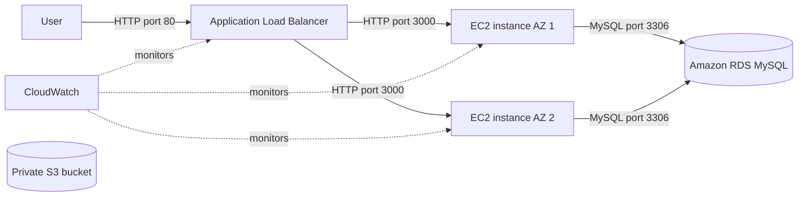

# Architecture

## Request Flow

A user sends an HTTP request to the Application Load Balancer (ALB). The ALB chooses a healthy EC2 instance in the Auto Scaling Group (ASG) and forwards the request to port 3000. The Node.js application reads or changes tasks in the shared RDS MySQL database.

## Why Each Service Is Used

**Application Load Balancer:** The ALB checks `/health` on every target and stops routing to unhealthy instances. Because it spans two Availability Zones, one application instance or zone can fail while another continues serving traffic.

**Auto Scaling Group:** The ASG maintains at least two EC2 instances. It replaces unhealthy instances and can add instances when average CPU usage rises. This demonstrates elasticity and self-healing.

**Amazon RDS:** Local EC2 storage would give each server different tasks and data could disappear when an instance is replaced. RDS provides one managed, persistent MySQL database shared by every EC2 instance. Set `db_multi_az = true` for an RDS standby in another Availability Zone; the default is off to reduce classroom cost.

**Amazon S3:** The private S3 bucket can hold architecture images, benchmark output, and submission screenshots. It demonstrates durable object storage separate from EC2.

**Amazon CloudWatch:** CloudWatch receives AWS metrics and defines alarms for high ASG CPU utilization and unhealthy ALB targets. Optional SNS email notifications make alarms visible without constantly watching the console.

## Cloud Computing Concepts Demonstrated

The project uses Infrastructure as Code, managed services, load balancing, horizontal scaling, health checks, shared persistent data, object storage, monitoring, and automated instance bootstrapping. Together, these show why cloud applications are easier to reproduce, observe, scale, and recover than a single manually configured server.
